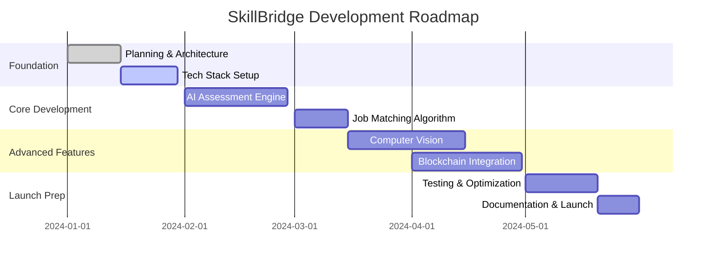

# SkillBridge India 🎯

> *Bridging the gap between talent and opportunity in India's evolving job market*

<div align="center">


</div>

---

## 🌟 The Vision

We're **Mind Over Mattress** - four university friends who noticed something broken in India's job ecosystem. While 65% of the workforce faces skill-job mismatches and unemployment among educated youth continues to rise, we decided to build a solution instead of just talking about the problem.

SkillBridge isn't just another job portal. It's an intelligent ecosystem that understands skills, matches talent meaningfully, and creates personalized growth paths for every user.

## 🚀 What Makes Us Different

### 🤖 **AI-First Approach**
- Dynamic skill assessments that adapt to user performance
- Semantic job matching beyond keyword hunting
- Personalized learning paths powered by machine learning

### 🌐 **Built for India**
- Native support for 22 Indian languages
- Rural employment network integration
- Cultural context awareness in matching algorithms

### 🔗 **Next-Gen Features**
- Blockchain-verified credentials
- Computer vision for practical skill demos
- Gamified learning experiences
- Real-time video interview platform

## 👨‍💻 The Team

<table>
<tr>
<td align="center">
<strong>Pranav Rana</strong><br>
<em>Lead AI Engineer</em><br>
<small>Makes machines think, sometimes better than us</small>
</td>
<td align="center">
<strong>Pratyush Rawat</strong><br>
<em>ML Research Specialist</em><br>
<small>Turns data into insights and coffee into code</small>
</td>
</tr>
<tr>
<td align="center">
<strong>Pratyush Shankar</strong><br>
<em>Blockchain & API Development</em><br>
<small>Builds the pipes that connect everything securely</small>
</td>
<td align="center">
<strong>Nihal</strong><br>
<em>Full Stack & Integration</em><br>
<small>Keeps everything running while we break stuff</small>
</td>
</tr>
</table>

## 🛠️ Tech Stack

<div align="center">

| Frontend | Backend | AI/ML | Database | Blockchain |
|----------|---------|-------|----------|------------|
| React.js | Python | TensorFlow | PostgreSQL | Ethereum |
| TypeScript | FastAPI | OpenAI GPT | Redis | Solidity |
| Tailwind CSS | Django | Computer Vision | MongoDB | Web3.js |

</div>

## 📈 The Problem We're Solving

<div align="center">

| Challenge | Impact | Our Solution |
|-----------|---------|--------------|
| **Skill-Job Mismatch** | 65% of workforce affected | AI-powered semantic matching |
| **Youth Unemployment** | Rising among graduates | Personalized skill development |
| **Rural Job Access** | Limited opportunities | Dedicated rural employment network |
| **Biased Hiring** | Unfair selection processes | Algorithmic fairness & transparency |

</div>

## 🎯 Key Features

### Core Platform
- **Intelligent Assessments** - Adaptive testing that evolves with user performance
- **Smart Matching** - ML algorithms that understand context, not just keywords
- **Learning Paths** - Personalized curriculum based on individual skill gaps
- **Multi-language Support** - Accessibility across India's linguistic diversity

### Advanced Capabilities
- **Computer Vision Integration** - Video-based skill demonstrations and analysis
- **Blockchain Credentials** - Tamper-proof, portable skill certificates
- **Gamification Engine** - Achievement systems that make learning engaging
- **Rural Network** - Connecting tier-2/3 cities with quality opportunities

## 📅 Development Timeline



## 🎪 Current Status

**Phase:** Foundation & Planning ✨

We're at the exciting "everything is possible" stage where we have:
- ✅ Comprehensive feature specification
- ✅ Technical architecture design
- ✅ Team roles and responsibilities defined
- ✅ Development environment setup
- 🔄 Core platform development (starting soon!)

## 🔮 Impact Goals

By launch, we aim to achieve:

- **30%** reduction in time-to-hire for employers
- **75%** improvement in job-skill match accuracy
- **50%** increase in rural job placements
- **90%** user satisfaction score

## 🤝 Getting Involved

We're building this in the open! While we're just getting started, here's how you can follow along:

### 🔜 Coming Soon
```bash
# This will work once we have something to show
git clone https://github.com/mindovermattress/skillbridge-india.git
cd skillbridge-india
npm install && pip install -r requirements.txt
npm run dev
```

### 📬 Stay Connected
- **Updates**: Watch this repo for development progress
- **Feedback**: Open issues for suggestions or questions
- **Collaboration**: We're open to partnerships and contributions

## 📄 License

MIT License - We believe in open innovation and shared growth.

---

<div align="center">

**Mind Over Mattress**
*Building solutions while the world sleeps*

Made with ❤️ for India's workforce

[📧 Contact](mailto:contact@mindovermattress.dev) • [🐦 Twitter](https://twitter.com/mindovermattress) • [💼 LinkedIn](https://linkedin.com/company/mindovermattress)

</div>
